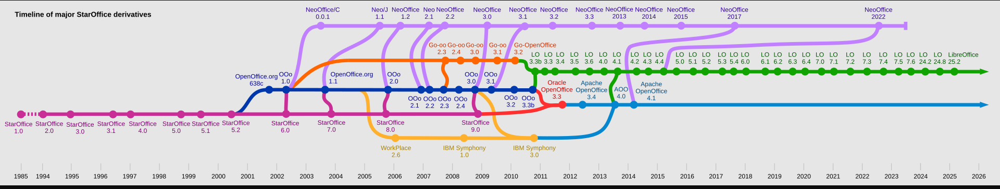

# 开放源代码软件（OSS）列表

> [!WARNING]
> 
> 该软件列表排名不分先后顺序。

## 设备控制软件

1. **RustDesk**：远程控制软件，支持全平台（iOS 设备不支持被控制）；支持自托管中继服务器，且官方提供一个免费中继服务器；支持内部/外部 IP 直连。
   
   - 官网：https://rustdesk.com
   - GitHub 仓库：https://github.com/rustdesk/rustdesk

2. **Scrcpy**：可通过计算机控制 Android 设备，支持使用 USB 或 TCP/IP 连接移动端设备。
   
   - GenyMotion 官网：https://www.genymotion.com
   - GitHub 仓库：https://github.com/Genymobile/scrcpy

## 驱动程序下载和管理工具

1. **Snappy Driver Installer**
   
   - 官网：https://sdi-tool.org
   - 下载页面：https://sdi-tool.org/download
   - SourceForge SVN 仓库：https://svn.code.sf.net/p/snappy-driver-installer/code/trunk

## 多媒体相关工具

### 一. 视频转码和格式转换相关工具

1. **HandBrake**：视频转码和格式转换工具，支持几乎全部的视频格式和码率。
   
   - 官网：https://handbrake.fr
   - GitHub 仓库：https://github.com/HandBrake/HandBrake

2. **MKVToolNix**：将任何格式的视频文件、字幕文件和音频混流为 Matroska（MKV）媒体文件。
   
   - 官网：https://mkvtoolnix.download
   - Git 仓库：https://codeberg.org/mbunkus/mkvtoolnix
   - 打包的源码文件列表：https://mkvtoolnix.download/sources

3. **FileConverter**：部分格式的视频转换，以及图片和文档的格式转换工具，集成至 Windows 的右键菜单中。
   
   - GitHub 仓库：https://github.com/Tichau/FileConverter

### 二. 视频播放器

1. **VLC Media Player**：由 VideoLAN 非营利组织开发和维护的跨平台视频播放器项目
   
   - VideoLAN 组织官网：https://www.videolan.org
   - VideoLAN GitHub 组织主页：https://github.com/videolan
   - VideoLAN GitLab 实例主页：https://code.videolan.org
   - VideoLAN 构建二进制发行版镜像站：https://get.videolan.org

2. **MPC-HC**：Windows 平台基于 DirectShow 和 FFmpeg 的视频播放器
   
   - 官网：https://mpc-hc.org
   - 原 GitHub 仓库（不再维护）：https://github.com/mpc-hc/mpc-hc
   - 由 clsid2 维护的 GitHub 仓库：https://github.com/clsid2/mpc-hc

3. **MPC-BE**：由 Aleksoid1978 维护的 MPC-HC 的分支
   
   - GitHub 仓库：https://github.com/Aleksoid1978/MPC-BE

### 三. 屏幕录制工具/截图工具

1. **OBS Studio**：强大的录屏和直播软件
   
   - 官网：https://obsproject.com
   - GitHub 仓库：https://github.com/obsproject/obs-studio
   - Microsoft Store 链接：[https://apps.microsoft.com/detail/xpffh613w8v6lv](https://apps.microsoft.com/detail/xpffh613w8v6lv)，应用 ID：`xpffh613w8v6lv`
   - Steam 链接：[https://store.steampowered.com/app/1905180/OBS_Studio/](https://store.steampowered.com/app/1905180/OBS_Studio/)，应用 ID：`1905180`

### 四. 图片编辑器

1. **GIMP**：跨平台图片编辑器
   
   - 官网：https://www.gimp.org
   - GitHub 镜像仓库：https://github.com/GNOME/gimp
   - GitLab 仓库：https://gitlab.gnome.org/GNOME/gimp

### 五. 视频编辑器

1. **OpenShot**：由 Python 编写的跨平台视频编辑器
   
   - 官网：https://www.openshot.org
   - GitHub 组织：https://github.com/OpenShot

2. **Kdenlive**：非线性视频编辑器，由 KDE 基金会开发并维护
   
   - 官网：https://kdenlive.org
   - GitHub 镜像仓库：https://github.com/KDE/kdenlive
   - GitLab 仓库：https://invent.kde.org/multimedia/kdenlive

### 六. 字幕编辑器

1. **Subtitle Edit**：使用 C# 编写的，支持 Windows 平台的字幕编辑器。
   
   - GitHub 仓库：https://github.com/SubtitleEdit/subtitleedit
   - 官网：http://www.nikse.dk/subtitleedit

2. **Aegisub**：跨平台字幕编辑器。
   
   - 官网：https://aegisub.org
   - 已存档的 GitHub 仓库：https://github.com/Aegisub/Aegisub
   - 维护的 GitHub 仓库：https://github.com/TypesettingTools/Aegisub

### 七. 音视频编解码库

1. **FFmpeg**：跨平台音视频编解码库（GPL）
   
   - Git 仓库：https://git.ffmpeg.org/ffmpeg.git
   - GitHub 镜像仓库：https://github.com/FFmpeg/FFmpeg
   - 官网：https://ffmpeg.org

2. **x265**：H.265 视频编解码库（GPL & 商业许可）
   
   - 官网：https://www.x265.org
   - BitBucket 仓库：https://bitbucket.org/multicoreware/x265_git

3. **x262**：H.262 视频编解码库（GPL）
   
   - Git 仓库：
     
     - [https://git.videolan.org/?p=x262.git;a=summary](https://git.videolan.org/?p=x262.git;a=summary)（浏览器访问）
     - [http://git.videolan.org/git/x262.git](http://git.videolan.org/git/x262.git)（Git 访问）

4. **x264**：H.264 视频编解码库（GPL & 商业许可）
   
   - VideoLan x264 项目主页：https://www.videolan.org/developers/x264.html
   - GitLab 仓库：https://code.videolan.org/videolan/x264.git

## 应用调试和逆向工程相关软件

### 一. 逆向工程平台/工具集

#### Windows/MacOS/Linux 平台可执行文件

1. **Ghidra**：由美国国家安全局创建和维护的软件逆向工程（SRE）框架，内置丰富的程序逆向插件。
   
   - GitHub 仓库：https://github.com/NationalSecurityAgency/ghidra

2. **Radare2**：基于命令行的逆向工程平台
   
   - GitHub 仓库：https://github.com/radareorg/radare2
   
   - 官网：https://rada.re
   
   - **iaito**：Radare2 官方提供的图形用户页面
     
     - GitHub 仓库：https://github.com/radareorg/iaito

3. **Cutter**：基于 [Rizin](https://github.com/rizinorg/rizin)（Radare2 的分支）项目、Ghidra C 语言反编译器等开源项目的逆向工程平台
   
   - 官网：https://cutter.re
   - GitHub 仓库：https://github.com/rizinorg/cutter

#### Android 平台应用程序/Java 字节码和软件包

1. **jadx**：Android/Java 应用程序包分析和逆向工具套件
   
   - GitHub 仓库：https://github.com/skylot/jadx

#### .NET C#/VB 应用程序

1. **dnSpy**：.NET 程序集逆向和调试工具集：
   
   - 官网：https://dnspy.org
   - GitHub 原仓库（已存档，不再维护）：https://github.com/dnSpy/dnSpy
   - 非官方维护 GitHub 仓库：https://github.com/dnSpyEx/dnSpy

2. **ilSpy**：.NET 程序集浏览器和反编译器：
   
   - GitHub 仓库：https://github.com/icsharpcode/ILSpy

### 二. 应用程序资源提取器和编辑器

1. **RisohEditor**：Windows PE 文件资源反编译器、编译器和编辑器
   
   - GitHub 仓库：https://github.com/katahiromz/RisohEditor

### 三. 应用程序调试工具

1. **x64dbg**：Windows 平台图形化程序跟踪调试软件
   
   - 官网：https://x64dbg.com
   - GitHub 仓库：https://github.com/x64dbg/x64dbg
   - SourceForge Snapshots：https://sourceforge.net/projects/x64dbg/files/snapshots

### 四. 可执行文件分析工具

1. **Detect It Easy (DiE)**：可执行文件类型识别和信息分析工具
   
   - Horsicq 作者主页：https://horsicq.github.io
   - GitHub 仓库：https://github.com/horsicq/Detect-It-Easy

### 五. 应用程序脱壳工具

#### .NET 应用程序

1. **.NET Reactor Slayer**：针对 [.NET Reactor 加壳工具](https://www.eziriz.com/dotnet_reactor.htm)的脱壳工具
   
   - 开发者 SychicBoy 官网主页：https://www.codestrikers.org
   - GitHub 仓库：https://github.com/SychicBoy/NETReactorSlayer

## 操作系统/操作系统内核

1. **Linux**: 全世界影响力最大的开放源码操作系统内核
   
   - Linux 基金会官网：https://www.linux.org
   - Linux Kernel Archives 官网：https://www.kernel.org
   - GitHub 仓库：https://github.com/torvalds/linux
   - 项目官方源码镜像站（Git）：https://git.kernel.org
   - Google 提供的源码镜像站（Git）：https://kernel.googlesource.com

2. **ReactOS**：类 Windows NT 操作系统，内核层代码为该项目原创，应用层引用 [Wine 项目](#一-应用兼容层)源码，**该操作系统目前尚未稳定**。
   
   - 官网：https://reactos.org
   - GitHub 仓库：https://github.com/reactos/reactos

3. **SerenityOS**：使用 C++ 编写的类 Unix 操作系统，支持 x86_64、ARM 和 RISC-V 架构。
   
   - 官网：https://serenityos.org
   - GitHub 仓库：https://github.com/SerenityOS/serenity

## 应用跨平台运行辅助工具

### 一. 应用兼容层

1. **Wine**：能在类 Unix 系统上运行大多数 Windows 应用程序的容器，由 WineHQ 社区发起并维护，CodeWeavers 提供项目贡献和资金支持，[CrossOver](https://www.codeweavers.com/crossover) 是其专业版本。
   
   - 官网：https://www.winehq.org
   
   - CodeWeavers 官网：https://www.codeweavers.com
   
   - GitHub 镜像仓库：https://github.com/wine-mirror/wine
   
   - GitLab 仓库：https://gitlab.winehq.org/wine/wine
   
   - 由第三方维护的 wine-builds 项目 **（提供 Wine 已编译的可执行文件）**：
     
     - https://github.com/Kron4ek/Wine-Builds
   
   - **Proton**：由 Value 维护的基于 Wine 等开源软件的 Windows 游戏运行平台，用于 SteamOS。
     
     - GitHub 仓库：https://github.com/ValveSoftware/Proton

### 二. 虚拟机

1. **QEMU**：计算机模拟器（可和 KVM 结合使用以达到和实体机几乎同样的运行效率）
   
   - 官网：https://www.qemu.org
   - GitLab 仓库：https://gitlab.com/qemu-project/qemu
   - GitHub 镜像仓库：https://github.com/qemu/qemu
   - 官方源码包镜像站：https://download.qemu.org

2. **VirtualBox**：由 Oracle 维护的虚拟机管理工具和计算机模拟器，用户页面使用 Qt 编写。
   
   - 官网：https://www.virtualbox.org
   - VirtualBox 官方发行版与源代码包镜像站：https://download.virtualbox.org/virtualbox
   - VirtualBox SVN 仓库：https://www.virtualbox.org/svn/vbox/trunk

### 三. 沙盒

#### Windows

1. **Sandboxie**：适用于 Windows 的沙盒隔离操作环境（分为社区和商业分支，社区分支开源，商业分支闭源收费）
   
   - GitHub 仓库：https://github.com/sandboxie-plus/Sandboxie
   - 官网：https://sandboxie-plus.com

## 办公辅助和自动化软件

### 一. 办公套件

1. **LibreOffice**：跨平台办公套件，优先支持自创 ODF 文档格式。
   
   - GitHub 组织：https://github.com/libreoffice
   - Gerrit：https://git.libreoffice.org
   - 已发布版本的源代码压缩包：https://download.documentfoundation.org/libreoffice/src
   - 官网：
     - https://www.libreoffice.org
     - https://zh-cn.libreoffice.org

2. **ONLYOFFICE** Desktop Editors & Document Apps：跨平台办公和协作套件，专注于支持 OOXML、ODF 等成熟的文档格式，拥有和 Microsoft Office 相近的用户页面：
   
   - 官网：https://www.onlyoffice.com
   - GitHub 组织：https://github.com/ONLYOFFICE

3. **Apache OpenOffice**：由 Apache 基金会维护的办公套件：
   
   - 官网：https://www.openoffice.org
   - GitHub 仓库：https://github.com/apache/openoffice
   
   > **Apache OpenOffice 和 LibreOffice 的关系和发展历史**：https://zh.wikipedia.org/zh-cn/LibreOffice#历史
   > 
   > 

4. **Collabora Online**：基于 Web 的办公套件，是 LibreOffice Online 的活跃分支（LibreOffice Online 已不再积极维护）
   
   - 官网：https://www.collaboraonline.com
   - GitHub 组织：https://github.com/CollaboraOnline

## 字体相关工具

### 一. 字体编辑器

1. **FontForge**：跨平台字体编辑器，具有 Python 解释器绑定。
   
   - 官网：https://fontforge.org
   
   - GitHub 仓库：https://github.com/fontforge/fontforge
   
   - 官方文档主页：
     
     - https://fontforge.org/en-US/documentation
     - https://fontforge.org/en-US/developers

### 二. 字体渲染工具

1. **FreeType**：跨平台字体渲染引擎
   
   - 官网：https://freetype.org
   - GitLab 仓库：https://gitlab.freedesktop.org/freetype/freetype
   - GitHub 镜像仓库：https://github.com/freetype/freetype

2. **MacType**：Windows 平台字体渲染引擎，可将字体更改为 macOS/Linux 用户页面的样式
   
   - 官网：https://www.mactype.net
   - GitHub 仓库：https://github.com/snowie2000/mactype
